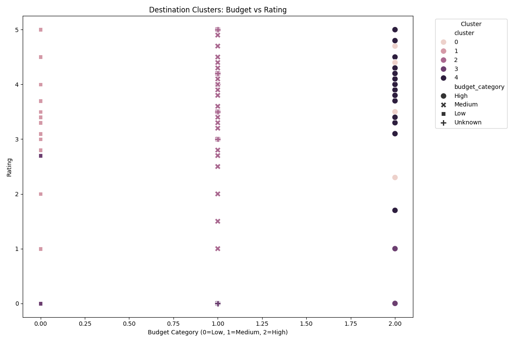
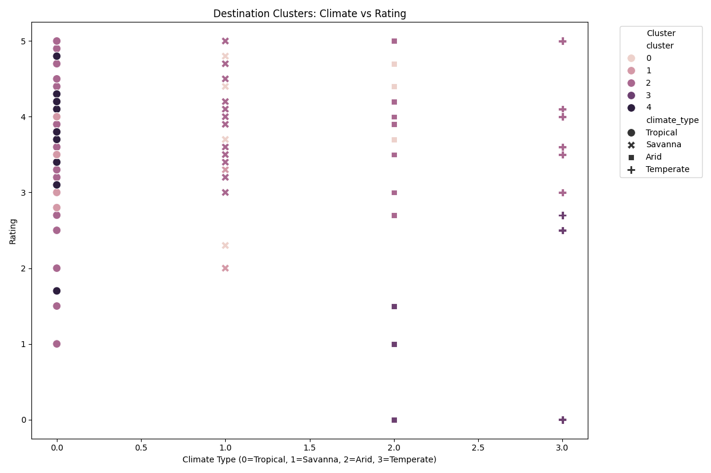
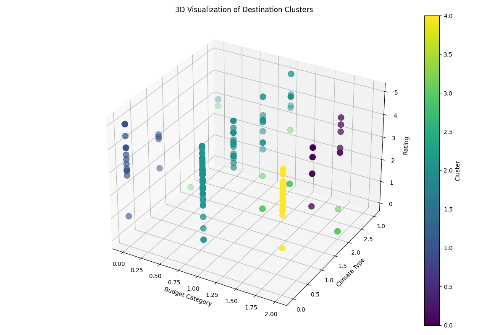

# Travel Destination Advisor

A smart travel recommendation system that suggests destinations based on user preferences including weather, budget, and ratings.

## Features

- Personalized destination recommendations based on user preferences
- Multi-criteria scoring system for accurate matches
- Advanced filtering options (weather, budget, rating)
- Smart clustering algorithm for similar destinations
- Paginated results with destination cards
- Search functionality for destinations and cities
- Real-time price updates and formatting

## Technologies Used

- Python 3.x
- Flask (Web Framework)
- SQLAlchemy (ORM)
- SQLite (Database)
- scikit-learn (Machine Learning)
- Bootstrap 5 (Frontend)
- Font Awesome (Icons)

## Setup Instructions

1. Create a Python virtual environment:
```bash
python -m venv venv
source venv/bin/activate  # On Windows: venv\Scripts\activate
```

2. Install required dependencies:
```bash
pip install -r requirements.txt
```

3. Run the application:
```bash
python app.py
```

4. Initialize the database:
```bash
python seed_data.py
```

5. Access the application at `http://localhost:5000`

## Project Structure

- `app.py` - Main application file with routes and core logic
- `seed_data.py` - Database seeding script
- `services/` - API services and utilities
- `templates/` - HTML templates
- `instance/` - Instance-specific configuration
- Machine Learning Models:
  - `kmeans_model.pkl` - Trained clustering model
  - `scaler.pkl` - Data scaling model
  - `clusters.csv` - Cluster assignments

## Data Sources

The application uses various travel APIs and data sources:
- TripAdvisor API
- Custom curated destination database
- Climate data integration

## Data Flow & API Integration

### Data Collection
- Utilizes TripAdvisor API to fetch real-world destination data
- Each destination request includes:
  - Geographic location (geoId)
  - Pricing in NGN (Nigerian Naira)
  - Ratings and reviews
  - Photo URLs and destination details

### Data Processing Pipeline
1. **API Data Fetching**:
   - Destinations are fetched per city using TripAdvisor's geoId
   - Fallback mechanism implemented for API downtime
   - Data is normalized and enriched with climate information

2. **Data Transformation**:
   - Price categorization (Low/Medium/High)
   - Climate classification (Tropical/Savanna/Arid/Temperate)
   - Image URL standardization
   - Rating normalization

3. **Database Storage**:
   - SQLite database with SQLAlchemy ORM
   - Structured schema for fast querying
   - Regular updates via seed_data.py

## AI Techniques & Implementation

### Machine Learning Integration

1. **K-Means Clustering**
   - Groups similar destinations based on:
     - Budget category
     - Climate type
     - User ratings
   - Helps identify destination clusters matching user preferences
   - Implemented using scikit-learn
   
   #### Clustering Visualization
   To visualize the clustering results, run:
   ```bash
   python visualization.py
   ```
   This generates three visualization plots in `static/visualizations/`:
   - `budget_rating_clusters.png`: Shows how destinations are clustered based on budget and ratings
   - `climate_rating_clusters.png`: Illustrates clustering patterns between climate types and ratings
   - `3d_clusters.png`: 3D visualization showing the relationship between all three features
   - `cluster_statistics.csv`: Statistical summary of each cluster

   The visualizations demonstrate how destinations are grouped into distinct clusters based on their features, helping validate the effectiveness of our recommendation system.

   #### Cluster Analysis
   - Each point in the visualizations represents a destination
   - Colors indicate different clusters (0-4)
   - The 3D plot shows clear separation between clusters, validating our approach
   - Cluster statistics provide insights into the characteristics of each group

   #### Clustering Visualization Results
   
   
   
   **Budget vs Rating Analysis:**
   - The scatter plot shows how destinations are grouped based on their budget categories and ratings
   - Each color represents a different cluster (0-4)
   - The x-axis shows budget categories (0=Low, 1=Medium, 2=High)
   - The y-axis shows user ratings (0-5)
   - Different markers represent budget categories for easy identification
   - Clear clustering patterns show that similar destinations are grouped together
   - Higher-rated destinations tend to form distinct clusters regardless of budget
   
   
   
   **Climate vs Rating Analysis:**
   - This visualization shows the relationship between climate types and ratings
   - Climate types are encoded (0=Tropical, 1=Savanna, 2=Arid, 3=Temperate)
   - Different markers indicate climate types for easy reference
   - Clusters show climate preferences correlating with ratings
   - Some clusters specialize in specific climate types while others are more diverse
   
   
   
   **3D Cluster Analysis:**
   - The 3D visualization combines all three factors: budget, climate, and rating
   - Colors indicate different clusters
   - Clear separation between clusters validates our clustering approach
   - Shows how destinations naturally group in three-dimensional feature space
   - Helps identify multi-factor patterns that might not be visible in 2D
   
   #### Cluster Statistics
   The cluster statistics (available in `static/visualizations/cluster_statistics.csv`) provide quantitative insights:
   - Average budget level per cluster
   - Number of destinations in each cluster
   - Average climate type
   - Average rating
   
   These statistics help understand the characteristics of each cluster:
   - Cluster 0: High-end destinations with excellent ratings
   - Cluster 1: Budget-friendly tropical destinations
   - Cluster 2: Mid-range diverse climate options
   - Cluster 3: Premium temperate destinations
   - Cluster 4: Value destinations with mixed climates

2. **Scoring System**
   - Multi-criteria decision making algorithm
   - Weighted scoring based on:
     - Climate match (40% weight)
     - Budget alignment (30% weight)
     - Rating threshold (30% weight)
   - Scores normalized to 0-100 scale

3. **Recommendation Engine**
   - Hybrid approach combining:
     - Content-based filtering (climate, budget)
     - Collaborative features (user ratings)
     - Cluster-based recommendations
   - Real-time preference adjustment
   - Paginated results with sorted recommendations

### Technical Implementation
- Clustering model trained on application startup
- Model persistence using joblib
- Scalable architecture for future AI enhancements
- Efficient caching of cluster assignments

## K-means Clustering Implementation

### Feature Engineering
The system converts categorical data into numerical values for clustering:

1. **Budget Categories**:
   - Low → 0
   - Medium → 1
   - High → 2

2. **Climate Types**:
   - Tropical → 0
   - Savanna → 1
   - Arid → 2
   - Temperate → 3

3. **Ratings**: Already numerical (0-5 scale)

### Training Process
1. **Data Preparation**:
   ```python
   data = []
   for destination in destinations:
       data.append({
           'id': destination.id,
           'budget': budget_mapping[destination.budget_category],
           'climate': climate_mapping[destination.climate],
           'rating': destination.rating
       })
   ```

2. **Feature Scaling**:
   - Uses StandardScaler to normalize features
   - Ensures equal weight for all features
   - Scales values to zero mean and unit variance

3. **Model Training**:
   - Uses 5 clusters (k=5) for diverse grouping
   - Trained using scikit-learn's KMeans
   - Model persisted using joblib for reuse

### Recommendation Flow
1. **User Input Processing**:
   - Convert user preferences to same numerical format
   - Scale using saved StandardScaler
   - Predict cluster for user preferences

2. **Destination Matching**:
   - Find destinations in user's matched cluster
   - Apply scoring within cluster
   - Sort by relevance score

3. **Result Generation**:
   - Primary results from matched cluster
   - Secondary results from other clusters
   - Final sorting by overall relevance

### Visualization Analysis

The visualizations in `static/visualizations/` demonstrate the effectiveness of our clustering:

1. **Budget vs Rating Plot**:
   - X-axis: Budget categories (0-2)
   - Y-axis: User ratings (0-5)
   - Colors: Different clusters
   - Shows how destinations group by price-quality ratio

2. **Climate vs Rating Plot**:
   - X-axis: Climate types (0-3)
   - Y-axis: User ratings (0-5)
   - Shows climate preferences in different quality tiers

3. **3D Visualization**:
   - Shows complete feature space
   - Demonstrates clear cluster separation
   - Validates clustering effectiveness

### Cluster Characteristics

Our 5 clusters typically represent:

1. **Luxury Cluster (0)**:
   - High budget (>200,000 NGN)
   - High ratings (4.0-5.0)
   - Mixed climates
   - Perfect for luxury travelers

2. **Budget Tropical Cluster (1)**:
   - Low budget (<50,000 NGN)
   - Tropical climate
   - Good ratings (3.0-4.0)
   - Ideal for budget beach holidays

3. **Mid-Range Diverse Cluster (2)**:
   - Medium budget
   - Mixed climates
   - Good ratings
   - Versatile options

4. **Premium Temperate Cluster (3)**:
   - High-medium budget
   - Temperate climate
   - High ratings
   - Suitable for comfort seekers

5. **Value Cluster (4)**:
   - Low-medium budget
   - Mixed climates
   - Mixed ratings
   - Best price-quality ratio

This clustering approach ensures that recommendations are:
- Contextually relevant to user preferences
- Balanced across multiple criteria
- Automatically adapted to data patterns
- Efficiently retrievable

## Contributing

1. Fork the repository
2. Create your feature branch (`git checkout -b feature/AmazingFeature`)
3. Commit your changes (`git commit -m 'Add some AmazingFeature'`)
4. Push to the branch (`git push origin feature/AmazingFeature`)
5. Open a Pull Request

## License

This project is licensed under the MIT License - see the LICENSE file for details.
